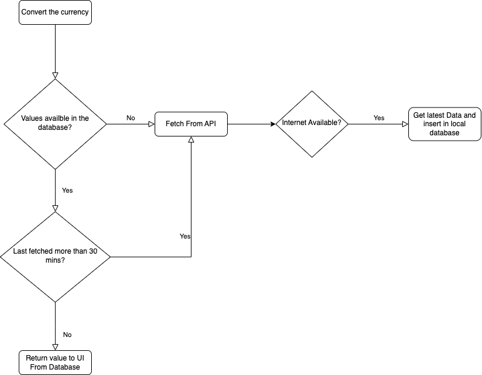

# Currency Convertor App Case Study
## Currency Conversion feature specs

### Story: Customer requests to see the converted currency value

### Narrative #1

```
As an online customer
I want the app to automatically load the converted value of 1 USD to all the currencies available.
```

#### Scenarios (Acceptance criteria)

```
Given the customer has connectivity
When the customer requests to see currencies value in terms of USD
Then the app should display the latest value from remote
if not already fetched less than 30 mins.
```

### Narrative #2

```
As an offline customer
I want the app to show the latest saved version of the converted currencies
```

#### Scenarios (Acceptance criteria)

```
Given the customer doesn't have connectivity
And there’s a cached version of the currencies
Then the app should display the last currencies saved.


Given the customer doesn't have connectivity
And the cache is empty
When the customer requests to see the feed
Then the app should display an error message
```

## Use Cases

### Load Currency names From API

#### Data:
- URL

#### Primary course (happy path):
1. Execute "Load currencies" command with above data.
2. System gets data from the URL.
3. System validates downloaded data.
4. System creates currency model from valid data.
5. System delivers currencies list.

#### Invalid data – error course (sad path):
1. System delivers invalid data error.

#### No connectivity – error course (sad path):
1. System delivers connectivity error.

---

### Load Currency converted data with respect of USD from Remote API

#### Data:
- URL

#### Primary course (happy path):
1. Execute "Load converted currencies" command with above data.
2. System downloads data from the URL.
3. System validates downloaded data.
4. System delivers converted currencies.


#### Invalid data – error course (sad path):
1. System delivers invalid data error.

#### No connectivity – error course (sad path):
1. System delivers connectivity error.

---

### Load currencies From Cache Use Case

#### Primary course:
1. Execute "Load converted currencies" command with above data.
2. System retrieves converted data from cache.
3. System delivers converted data.

#### Retrieval error course (sad path):
1. System delivers error.


#### Empty cache course (sad path): 
1. System delivers no converted data

---
## Flowchart



## Model Specs

### Converted Currency

| Property        | Type                |
|-----------------|---------------------|
| `timeStamp`     | `Int`              |
| `base`          | `String`            |
| `rates`         | `[String: Double]`  |
---
